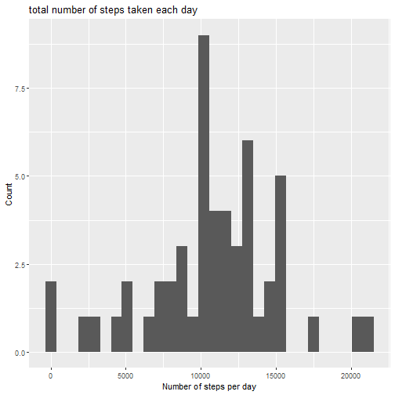
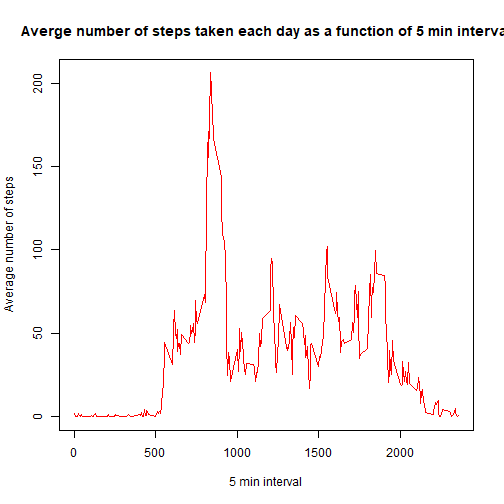
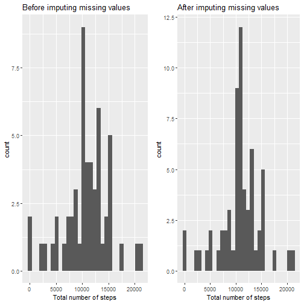
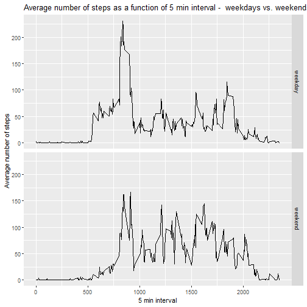

# Loading and preprocessing the data

Before loading en procesding data the required packages are loaded from the library


```r
library(dplyr)
library(ggplot2)
library(gridExtra)
```

Then the data files are red and stored in variable d, 


```r
download.file("https://d396qusza40orc.cloudfront.net/repdata%2Fdata%2Factivity.zip",
              destfile = "indata.zip")

# Reading data using base R
d <- read.csv(unz('indata.zip','activity.csv'), header = T)
d$date <- as.Date(d$date, format="%Y-%m-%d")
```

and the date column is converted to a "date" variable. Moreover, some processing of
data and summery is done using the dplyr package. 


```r
d1 <- d %>% 
        group_by(date) %>% 
        summarise(sum_steps = sum(steps),
                  mean_steps = mean(steps),
                  median_steps = median(steps))
```

# What is mean total number of steps taken per day?
So `d1` is a a data frame grouped by the date variable and summerised. The total number
of steps `sum_steps` is calculated. This is then visualised using a histrogram. 


```r
ggplot(d1,aes(x=sum_steps)) + geom_histogram() + 
        labs(title= "total number of steps taken each day",
             x = "Number of steps per day",
             y = "Count")
```



More over the mean and median is calculated and


```r
mean(d1$sum_steps,na.rm = TRUE)
```

```
## [1] 10766.19
```

```r
median(d1$sum_steps, na.rm=TRUE)
```

```
## [1] 10765
```


# What is the average daily activity pattern?
To have an overview of the activity pattern, a time series plot is used, where the averge number of steps is visualised as a function of the 5 min interval variable.
Just for practice, this will be done using the `tapply` function in R, and then visualised with base R. 


```r
TimeSeries_steps <- tapply(d$steps,d$interval,mean, na.rm=TRUE)
plot(rownames(TimeSeries_steps),TimeSeries_steps, type ="l",col="red",
     xlab = "5 min interval",
     ylab = "Average number of steps",
     main = "Averge number of steps taken each day as a function of 5 min interval")
```



from the plot it seen that an interval below 1000 min is haveing the maxium averged number of steps. In order do get the exact interval, a small dataframe is generated inorder to convert the list `timeSeries_steps`:


```r
MaxInterval <- as.data.frame.table(TimeSeries_steps)
names(MaxInterval) <- make.names(c("Interval","AvgSteps"))
MaxInterval[which.max(MaxInterval$AvgSteps),]
```

```
##     Interval AvgSteps
## 104      835 206.1698
```

So at the interval 835 the maximum averaged number of steps. 

# Imputing missing values

Now the analysis performed was before replacing or imputing any missing values to avoid bias in our output data. So to get an idea of how many missing data there is in the data set, the number of rows containing `NA` was calculated and assigned to the variable `miss`


```r
miss <- sum(!complete.cases(d))
miss
```

```
## [1] 2304
```

For this case it was decided to replace all NA with the average mnumber of steps in that 5 min interval where the data was missing. This is done by using a simple for loop with a condition, which when matched, the replacement will take place. 


```r
d2 <- d
for (i in 1:nrow(d)) {
        if (is.na(d$steps[i])) {
                d2$steps[i] <- MaxInterval[which(MaxInterval$Interval %in% d$interval[i]),2]
        }
} 
```
The new dataset `d2` is then created with the missing values replaced. It is now interesting to see the effect of the replacement. So a histrogram is created and compared to the histogram created earlier


```r
d3 <- d2 %>% 
        group_by(date) %>% 
        summarise(sum_steps = sum(steps),
                  mean_steps = mean(steps),
                  median_steps = median(steps))
g1 <- ggplot(d1,aes(x=sum_steps)) + geom_histogram()+ggtitle("Before imputing missing values")+xlab("Total number of steps")
g2 <- ggplot(d3,aes(x=sum_steps)) + geom_histogram()+ggtitle("After imputing missing values")+xlab("Total number of steps")


grid.arrange(g1, g2, nrow = 1)
```



It can be seen that there is a slight change in the shape and count of total number steps taken each day. 

Then the mean and median of the new dataset is calcluated, and inserted into a datafrem where the "old" values also are included


```r
Variable <- c("mean before","median before","mean after","median after")
Value <- c(mean(d1$sum_steps, na.rm=TRUE),median(d1$sum_steps, na.rm=TRUE),
           mean(d3$sum_steps),median(d3$sum_steps))
Results <- data.frame(Variable,Value)
Results
```

```
##        Variable    Value
## 1   mean before 10766.19
## 2 median before 10765.00
## 3    mean after 10766.19
## 4  median after 10766.19
```
From the output above, a sligt change is observed in the values. Which mean that the replacement of NA has a slight impact on the total daily number of steps. 


# Are there differences in activity patterns between weekdays and weekends?
In order to compare the activity pattern in the weekdays vs. weekends a new factor variabble is created extracting the day of the week from the date column.


```r
d2$days <- weekdays(d2$date)
d2$WeekorEnd <- factor(ifelse(d2$days %in% c("lørdag","søndag"), "weekend", "weekday" ))
```

Then the data is summerized and stored in a new variable and then visualised in a panel plot comparing the weekdays with weekends 


```r
TimeSeries_steps_after <- d2 %>% 
        group_by(interval,WeekorEnd) %>% 
        summarise(sum_steps = sum(steps),
                  mean_steps = mean(steps),
                  median_steps = median(steps))

p1 <- ggplot(TimeSeries_steps_after,aes(x=interval,y=mean_steps,group=WeekorEnd))
p2 <- p1+geom_line()+facet_grid(TimeSeries_steps_after$WeekorEnd)
p3 <- p2 + labs(title = "Average number of steps as a function of 5 min interval -  weekdays vs. weekends",
                x = "5 min interval",
                y = "Average number of steps")
p3
```



From panel plots above, that more steps are taken during the weekends, which indicates more overall acitivy. 
